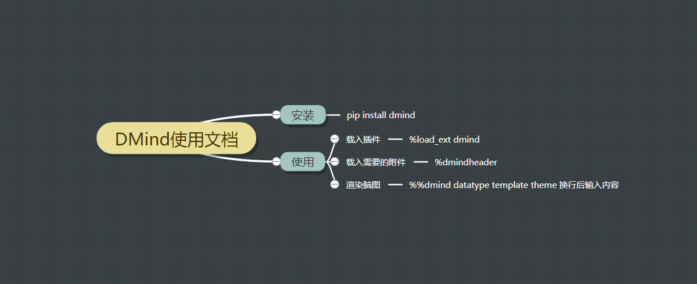
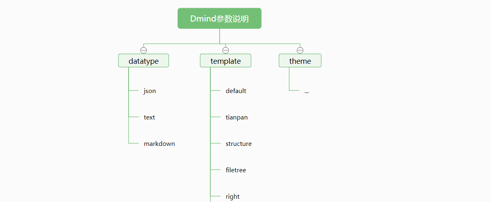

# DMind

    是一个思维导图插件
`DMind` 是一个 `Jupyter notebook` 的思维导图插件.    
利用百度脑图的开源库实现渲染, 支持 `json`, `markdown`, `text` 格式.


## 安装
通过 `pip` 安装
```bash
    pip install dmind
```

## 使用
### text 格式
```
%%dmind text

DMind
    是一个 jupyter notebook 插件
    是一个思维导图插件
```


### markdown 格式, 逻辑结构图
```
%%dmind markdown right

# DMind使用文档
## 安装
### pip install dmind
## 使用
### 载入插件
#### %load_ext dmind
### 载入需要的附件
#### %dmindheader
### 渲染脑图
#### %%dmind datatype template theme 换行后输入内容
```


### json 格式 , 目录组织图, 文艺绿
```
%%dmind json filetree fresh-green

{
    "root": {
        "data": {
            "text": "Dmind参数说明"
        },
        "children": [
...
```



[查看示例](./example/example.ipynb)
